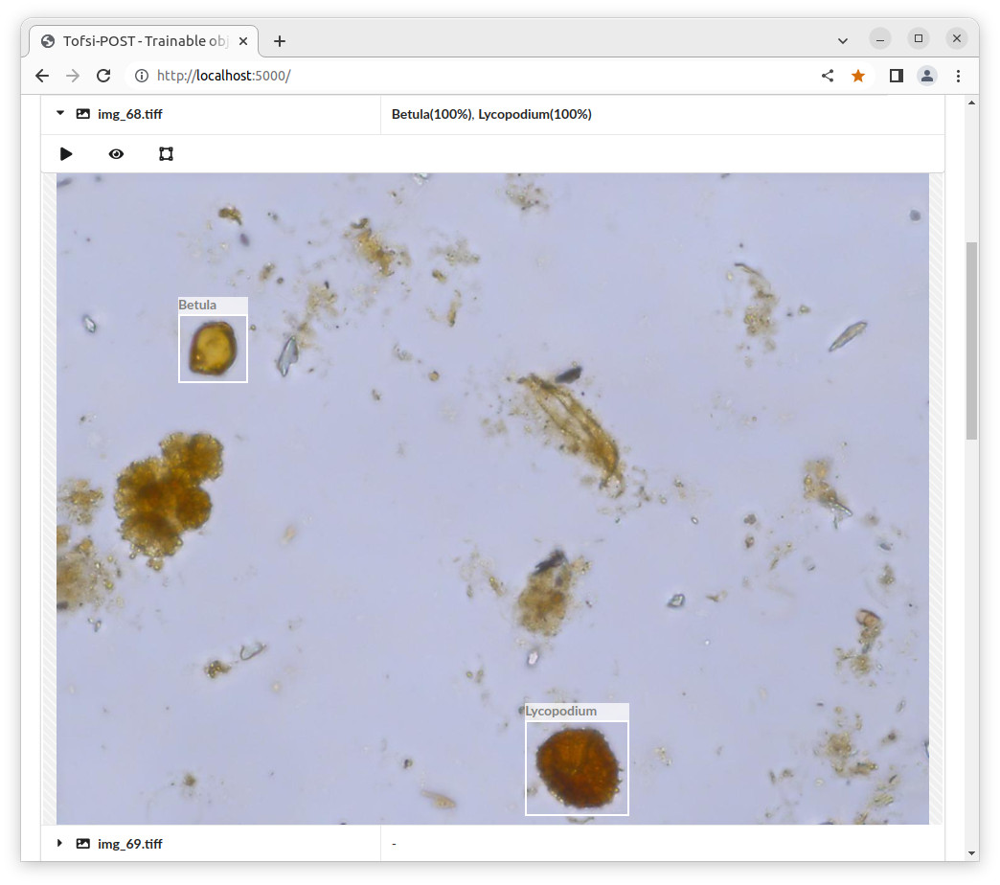

# Tofsi-POST
**T**rainable **o**bject **f**inder, **s**elector and **i**dentifier for **po**llen, **s**pores and other **t**hings (Tofsi-POST)

Named after [Tofsy von Post](https://link.springer.com/article/10.1007/s00334-017-0630-2#Fig1), the wife of the pioneer of pollen analysis Lennard von Post.

***

Screenshot:

